# Contact Vault v2.0 (Web)

A multi-user contact manager built with Flask — the web counterpart to
[Contact Vault v1.0.0](https://github.com/) (desktop, CustomTkinter + JSON).

Sign in with Google, then add, search, edit, and delete contacts — same
case-insensitive duplicate detection and undo behavior as the desktop
version, now per-user, in the browser, with a full audit trail.

## Features

- **Google OAuth login** — no passwords ever stored; each account's
  contacts are strictly isolated from every other account's
- **Full CRUD** — add, edit, delete, and search contacts by name or email
- **Bulk operations** — paste-to-import multiple contacts at once, or
  select several and delete them together, both fully undoable
- **Automatic name derivation** — leave the name blank and it's guessed
  from the email (`jane.doe@` → "Jane Doe"), same as v1.0.0
- **Case-insensitive duplicate detection** — enforced twice: once in the
  service layer for a friendly error message, and again at the database
  level via a unique index, so a duplicate can never slip through
- **Undo, two ways** — a quick "undo last action" on the dashboard, or
  open the Activity Log and undo any past action individually, even if
  other actions happened since (with automatic conflict handling if the
  data has changed too much to cleanly reverse)
- **Activity Log** — permanent, timestamped history of everything done
  to your contacts, with human-friendly relative times ("2 minutes ago")
- **Export** — download your contacts as CSV or JSON at any time
- **Light and dark themes** — toggle in the nav, remembered across
  visits, defaults to your system preference on first visit

## Tech stack

- **Flask** — web framework
- **SQLAlchemy + Flask-Migrate (Alembic)** — ORM and database migrations
- **SQLite** — local database, zero setup (SQLAlchemy makes this
  swappable for PostgreSQL later with no code changes)
- **Flask-Login** — session management
- **Authlib** — Google OAuth ("Continue with Google")
- **Flask-WTF** — forms and app-wide CSRF protection
- **pytest + pytest-cov** — test suite, 100% statement coverage

## Architecture

Layered, same philosophy as v1.0.0: each layer only knows about the one
below it, which is what makes the business logic testable without a
running server and reusable if another interface (a CLI, an API) is ever
added alongside the web routes.

```
routes (Flask blueprints, HTTP concerns only)
  -> ContactService (business logic: dedup, undo, bulk ops - no Flask imports)
    -> SQLAlchemy models (User, Contact, ActivityLog)
      -> SQLite (Postgres-ready, same code either way)
```

## Screenshots

**Login**

| Dark | Light |
|---|---|
| 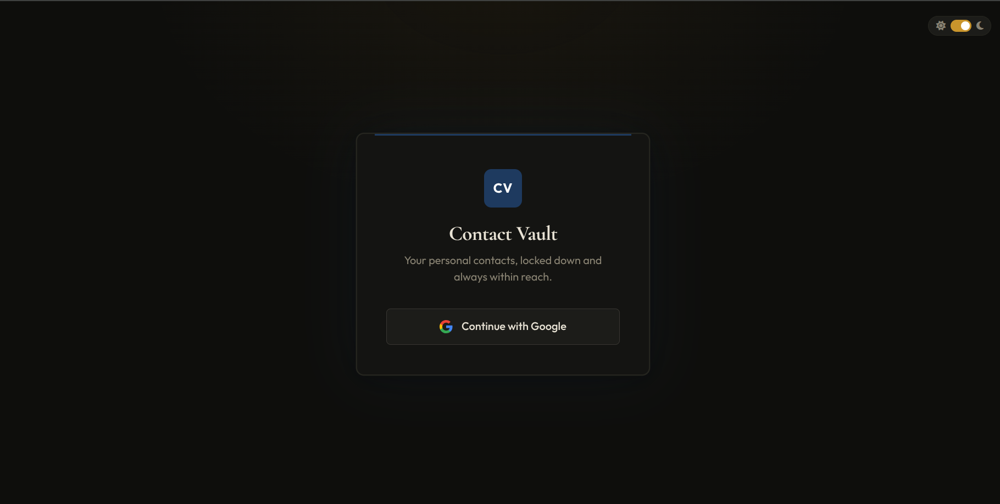 | 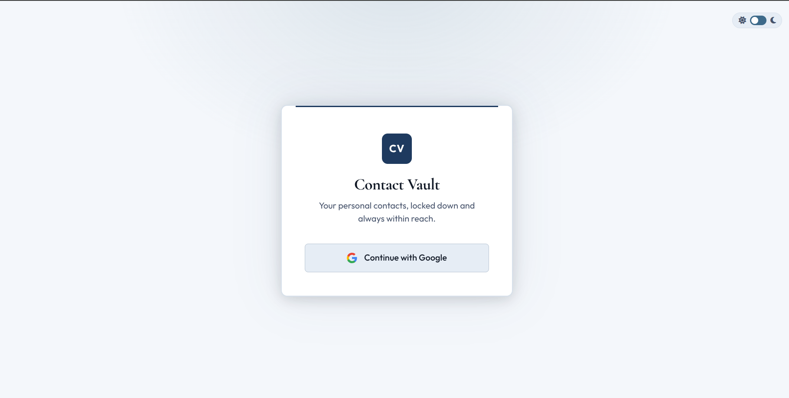 |

**Dashboard**

| Dark | Light |
|---|---|
| 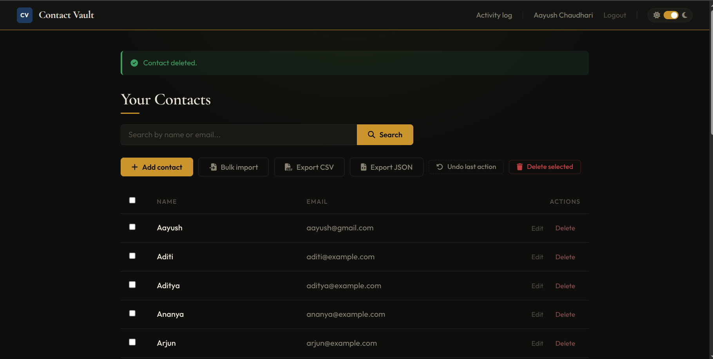 | 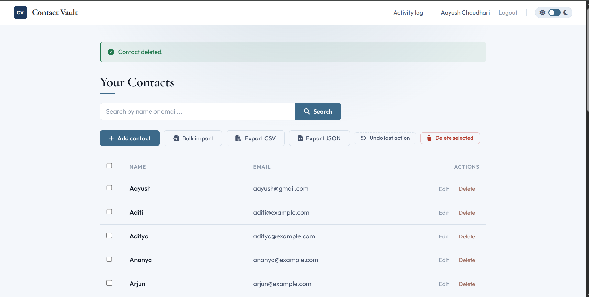 |

**Bulk select and delete**

| Dark | Light |
|---|---|
| 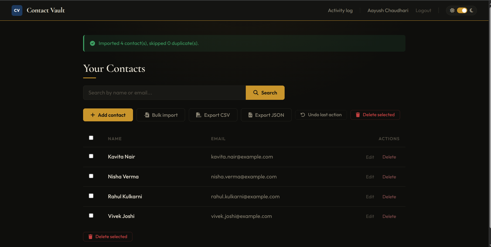 | 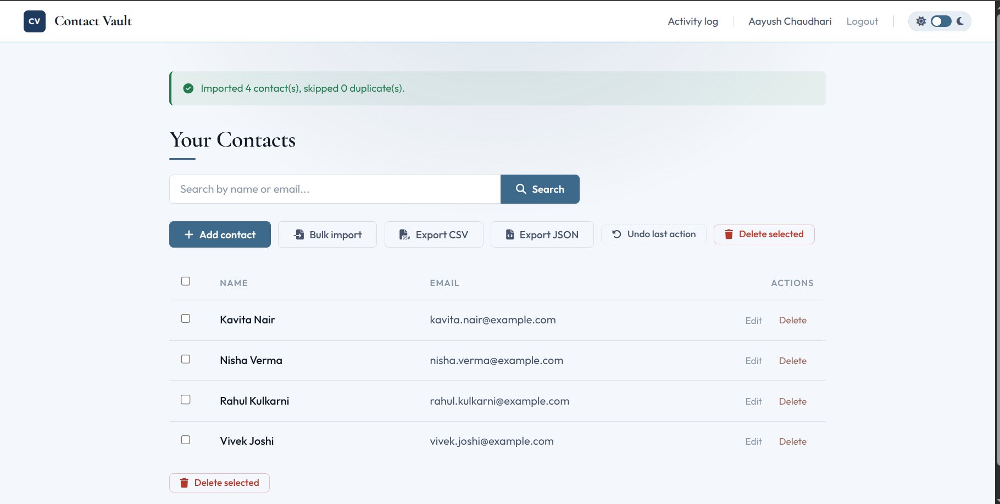 |

**Empty state**

| Dark | Light |
|---|---|
| 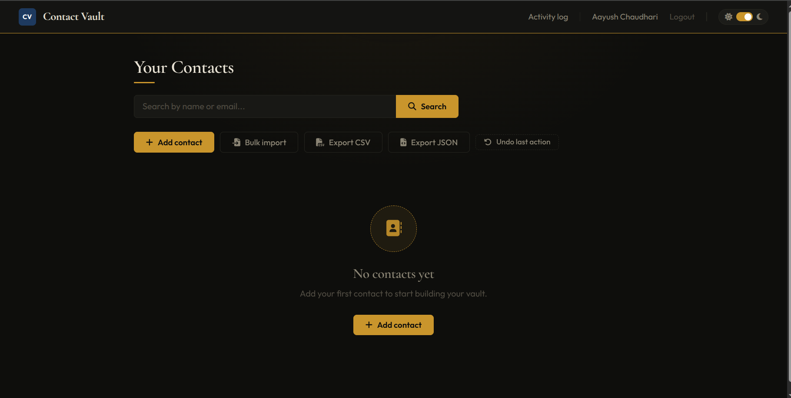 | 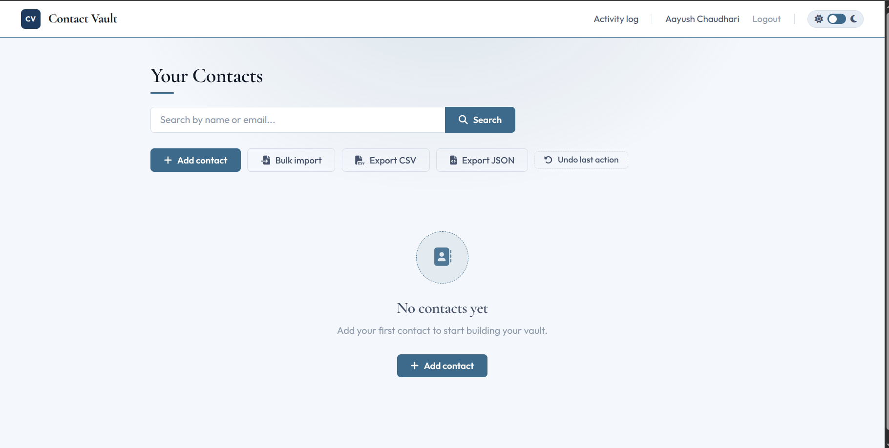 |

**Add contact** — name is optional, derived from the email if left blank

| Dark | Light |
|---|---|
| 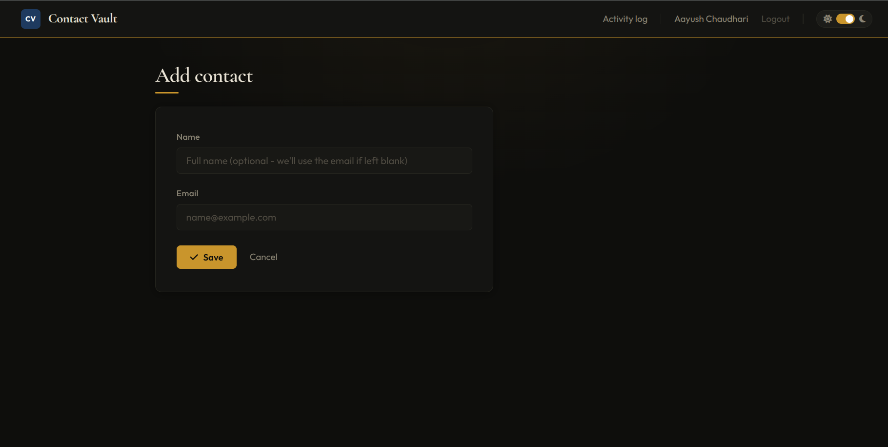 | 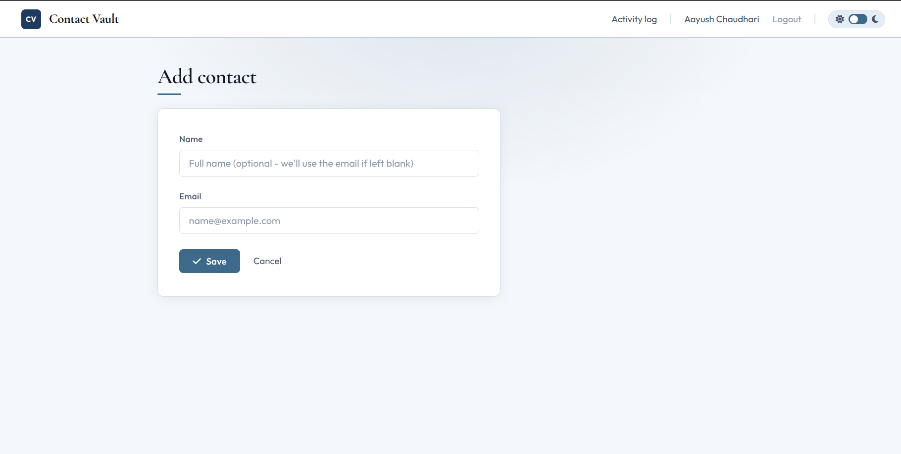 |

**Bulk import**

| Dark | Light |
|---|---|
| 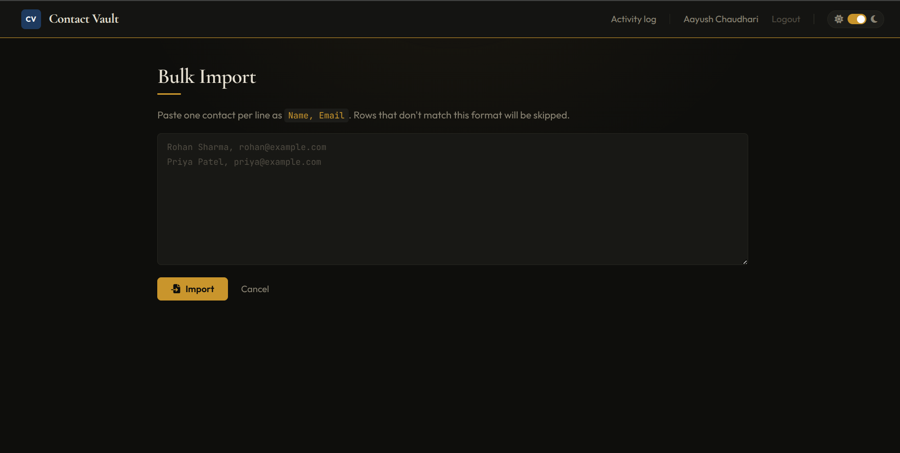 | 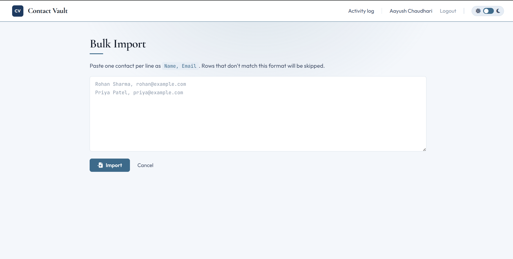 |

**Activity Log** — every action logged, with per-entry undo

| Dark | Light |
|---|---|
| 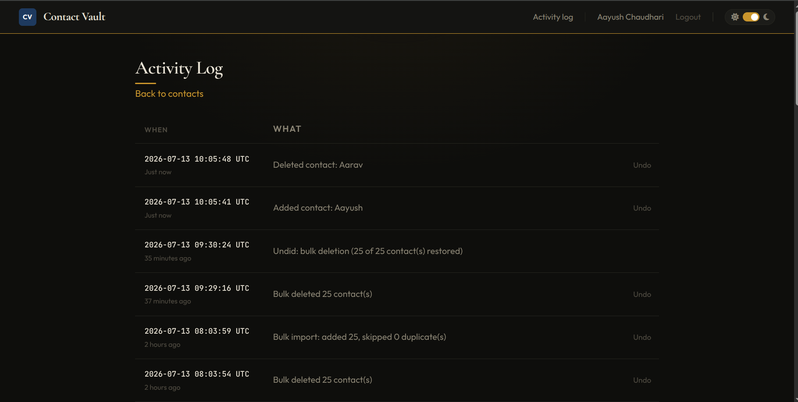 | 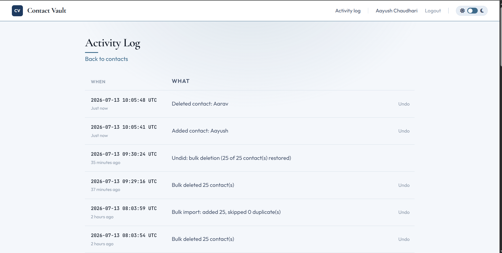 |

## Getting started

```bash
git clone <this-repo-url>
cd contactvault-v2
python -m venv venv
source venv/bin/activate        # Windows: venv\Scripts\activate
pip install -r requirements.txt

cp .env.example .env
# Edit .env: set SECRET_KEY to any random string, and add your own
# Google OAuth credentials (see below)

flask db upgrade                # creates instance/contactvault.db
flask run
```

Then open `http://localhost:5000`.

### Setting up your own Google OAuth credentials

Since this repo is public, Google login requires each person running it
locally to use their own free credentials (client secrets can't be
committed to a public repo):

1. Go to [Google Cloud Console](https://console.cloud.google.com/apis/credentials)
2. Create an OAuth 2.0 Client ID (Web application)
3. Add `http://localhost:5000/auth/login/google/callback` as an authorized redirect URI
4. Copy the client ID and secret into your `.env` file
5. Under **Audience**, add your own Google account as a test user (the app is unverified, so only listed test users can sign in)

## Running tests

```bash
pytest --cov=app --cov-report=term-missing
```

118 tests, 100% statement coverage across models, services, and routes.

## Project structure

```
app/
├── auth/               # Google OAuth login flow
├── contacts/           # CRUD, bulk ops, import/export routes + forms
├── models/              # User, Contact, ActivityLog
├── services/            # ContactService - all business logic lives here
├── static/css/          # single stylesheet, light + dark theme tokens
├── templates/           # Jinja templates
├── config.py
├── extensions.py         # shared db, login_manager, oauth, csrf instances
└── utils.py              # name derivation, relative-time formatting
migrations/               # Alembic migration history
tests/                    # pytest suite, mirrors app/ structure
```

## License

MIT — see [LICENSE](LICENSE).
